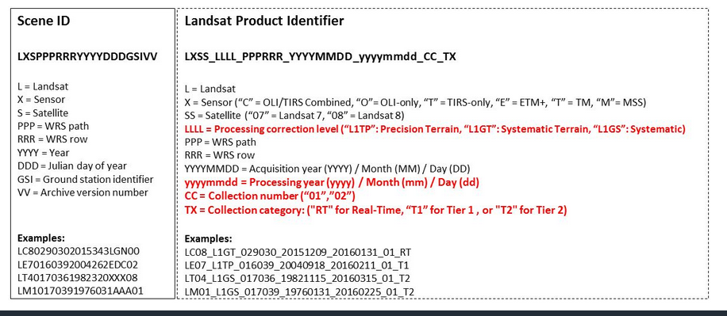

# 

[](https://travis-ci.org/dgketchum/Landsat578)
[](https://codecov.io/gh/dgketchum/Landsat578)
[](https://badge.fury.io/py/Landsat578)
[](https://raw.githubusercontent.com/dgketchum/Landsat578/master/LICENSE)

# Easy Landsat Download

Download and unzip Landsat 5, 7, and 8 (a.k.a. LT5, LE7, LC8) images 
via the Google service automatically using a command line interface or
a simple python script. (Now you can get all Landsat [1, 2, 3, 4, 5, 7, 8]!)

Python 2.7 and 3.6 compatible.

## Install

To get the package from PyPi:
```
$ pip install Landsat578
```

Landsat instruments orbit the earth in sun-synchronous fashion.
They pass over each place at approximately the same 
time of day, every 16 days. The area within each image is
predefined and is described by (path,row) coordinates of
the World Reference System 2 (WRS2).
This system applies to all Landsat missions since LT4.
Every place on Earth falls under at lease one path/row 'scene.'
Some places fall within overlapping path/row scenes. Landsat 
'descends' from North to South in the day, these images are of
most interest to researchers, though nighttime images are also
available. You can get GIS data of WRS2 [here.](https://landsat.usgs.gov/pathrow-shapefiles)

See WRS2 over the US state of Montana. Scene 38, 27 is highlighted
in purple. Note overlap of neighboring scenes.

# 


# Run

The first time running this code will download and package a large
list of scenes. This should thereafter be updated if one is after
the latest imagery.  This is a large file and will need about 3GB
memory available to the python process to process it.

landsat --update-scenes

If you know the path and row of a location, you can enter it in the 
command line interface to download and unzip images there between
your specified start and end dates.  You must choose a satellite.
Within the package you downloaded, you need to call landsat.py.
Dates are entered as YYYY-MM-DD format, e.g. 2008-05-31.

```
$ landsat -sat 7 --start 2007-05-01 --end 2007-05-31 --path 38 --row 27 -o /path/to/folder
```
This command will find the two images that were captured by Landsat
5 of scene 38, 27 in the month of May, 2007 and unzip them to your folder.
Use the optional parameter ```--return-list``` to just get a list
of what was found:


```
$ landsat -sat 7 --start 2007-05-01 --end 2007-05-31 --path 38 --row 27 --return-list
```

This will return the two image scene IDs and print to your screen.

```
['LE70360292007122EDC00', 'LE70360292007138EDC00']
```
These images happen to have been taken 2007-05-02 (Day of Year, DOY: 122),
and on 2007-05-18 (DOY 138). See NOAA's day of year [calendar.](https://www.esrl.noaa.gov/gmd/grad/neubrew/Calendar.jsp)

The naming conventions of Landsat images are as follows from
the USGS Landsat [site.](https://landsat.usgs.gov/what-are-naming-conventions-landsat-scene-identifiers)


# 

You can also download by WGS decimal degrees coordinates (i.e., latitude and longitude):
```
$ landsat -sat 7 --start 2007-05-01 --end 2007-05-31 --lat 46.5 --lon -107.5 
```
A negative number lat is in the southern hemisphere, a negtive lon is the 
western hemisphere.  

# Help
```
landsat -h
```
This command will show you all positional (mandatory) and optional arguments.

# 2018 dgketchum

